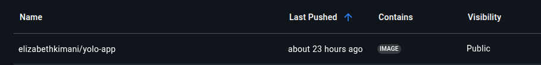

# Yolo - Full Stack MERN Application with Docker

A production-ready MERN (MongoDB, Express, React, Node.js) application with Docker containerization.

## 📌 Table of Contents
- [Features](#-features)
- [Prerequisites](#-prerequisites)
- [Project Structure](#-project-structure)
- [Docker Setup](#-docker-setup)
- [Local Development](#-local-development)
- [Environment Variables](#-environment-variables)
- [Deployment](#-deployment)

## 🌟 Features
- Containerized microservices architecture
- MongoDB with persistent storage
- React 18 with optimized production build
- Node.js backend with Express
- Docker Compose for development/production
- Pre-configured CI/CD pipeline example
- Health checks and monitoring

## 🛠 Prerequisites

| Requirement       | Version   | Installation Guide                     |
|-------------------|-----------|----------------------------------------|
| Docker            | 20.10+    | [Docker Install](https://docs.docker.com/get-docker/) |
| Docker Compose    | 1.29+     | [Compose Install](https://docs.docker.com/compose/install/) |
| Node.js           | 16.x      | `nvm install 16`                       |
| npm               | 8.x+      | Comes with Node.js                     |

## 📁 Project Structure
yolo/
├── client/
│ ├── public/
│ ├── src/ 
│ ├── Dockerfile 
│ ├── package.json 
│ └── .env.development
│
├── backend/
│ ├── controllers/
│ ├── models/ 
│ ├── routes/ 
│ ├── Dockerfile 
│ ├── package.MongoDB modelsjson 
│ └── .env 
│
├── docker-compose.yaml 
└── README.md # This document

## 🐳 Docker Setup

### Container Images



### Development Environment
```bash
# Build and start all services
docker-compose up --build

# View running containers
docker-compose ps

# Access logs
docker-compose logs -f client

#Production Build
docker-compose -f docker-compose.prod.yml up --build -d

#Local Deployment
##Frontend Setup
cd client
npm install
npm start  # http://localhost:3000

##Backend Setup
cd backend
npm install
npm run dev  # http://localhost:5000

#Environmental Variables
##Backend
MONGO_URI=mongodb://mongo:27017/yolo
PORT=5000

##Frontend
REACT_APP_API_URL=http://localhost:5000
REACT_APP_ENV=development

#Deployment
##Push to dockerhub
docker build -t elizabethkimani/yolo-app .
docker push elizabethkimani/yolo-app